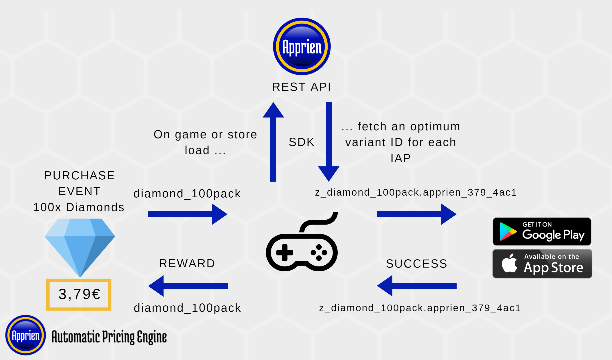

# ApprienUnitySDK
Apprien Unity SDK is a lightweight client for Apprien Automatic Pricing API for mobile game companies using Unity. Apprien increases your In-App Purchases revenue by 20-40% by optimizing the prices by country, time of the day and customer segment.

It typically takes 2-4h to integrate Apprien Unity SDK with your game.

The minimal compiled footprint of ApprienUnitySDK is roughly 16KB.

`Apprien.cs` is a standalone C# class library that uses Apprien Game API. Other files are for Unity Editor integration and unit tests. An example store without purchasing logic is available in `ExampleStoreUIController.cs`

In case of any network or backend failure, ApprienUnitySDK will always revert to the base IAP ID and show the fixed prices.

## Prerequisites

You need to obtain an OAuth2 Access Token from Apprien. You also need to setup app store integrations by providing Apprien the credentials to access the platforms to perform price optimization and automatically create the Apprien-generated products for your game.

Currently Apprien supports the following platforms
* Google Play Store

Upcoming support on our roadmap
* Apple App Store

Please contact sales@apprien.com to get the integration instructions for other stores.

Apprien provides your Quality Assurance team generic Apprien Game Testing Documentation and Test Cases on how to detect typical issues with your game and Apprien integration. By incorporating the Test Cases to your game's testing plan, you can ensure that Apprien integration works smoothly for your players.

## Setup

__1) Acquire the authentication token__ as described above in the [Prerequisites](#prerequisites) section

__2) Open your project__ in a supported Unity version (see [Compatibility Notes](#compatibility-notes) below)

__3) Import the UnityPurchasing module and implement a store controller__ or use our example controller to get started.

__4) Import Apprien__ 
  1) You can either use our prepared `.unityPackage` archives available in Releases containing everything required __(recommended)__ with an optional example store implementation
  2) Or copy `Assets/Apprien/Scripts/Apprien.cs` to your project.

__5) Add integration to your Store controller__

(For an example on how Apprien can be integrated with your Store controller, see `ExampleStoreUIController.cs`.)

Before your game with Apprien integration goes live, Apprien will generate IAP id variants for your IAP products. These variants will contain the same reward, description and other product details, only the price will be different. When the integration is live for your players, Apprien will then map your IAP id to the variant that corresponds with the optimum price.

You need to integrate ApprienUnitySDK to your current Store controller. The general overview of the end result is as follows: 
* When the store is initialized, you have the IAP ids of the products for your game.
* You initialize an instance of ApprienManager class and wrap your products inside the ApprienProduct instances. See the [relevant part of the API documentation](#class-apprienproduct).
* Before you fetch the prices from the store, the IAP ids are passed to the Apprien Game API in a web request, which will respond with one IAP id variant for each product, with optimal pricing. The `ApprienProduct` instances that were passed to the relevant API method have been populated with optimized product variants.
* You fetch the prices from Google and Apple using the `UnityEngine.Purchasing.IStoreListener` interface (or by other means). It is important to fetch prices for all products, both default and those returned from Apprien. If using the ConfigurationBuilder in Unity, it is safer to first add all defaults products to the builder, in case connection issues with Apprien, and only then fetch optimum prices, and initialize the `IStoreListener` (see code samples below in [SDK API documentation](#sdk-api-documentation)).
* __It is important that upon displaying the Apprien optimized prices for products to the players, you notify the Apprien API endpoint of these events using the SDK or by other means. Otherwise Apprien will be unable to optimize the pricer for your products. See [API documentation](#sdk-api-documentation) below, specifically `ApprienManager.ProductsShown`.__. This is when the user is displayed with the optimized price, e.g. when the store view is opened and the product is displayed with a price tag.
* You display the same product / reward on the in-game store, and the IAP id is the variant IAP id received from Apprien.
* When a user purchases the product, the sale and transaction will be for the Apprien IAP id variant, instead of the fixed price product. The SDK has a failsafe, where any errors or connection problems will return the base IAP id instead, so that the players will be able to purchase products, only with the fixed price.
* Your Store controller should refresh the optimal prices every now and then. Apprien updates the price points every 15 minutes. If you only fetch the Apprien-optimized prices during game load, players will not get served the most optimal price.

### System Overview


See the [SDK API documentation](#sdk-api-documentation) below for code examples on how to use the SDK to fetch the optimal prices. Additionally, `ExampleStoreUIController.cs` shows a minimal example of enabling Apprien dynamic pricing in an abstract store. 

Typically the product IAP IDs have been hard-coded somewhere in your game (ScriptableObjects, Unity IAP Catalog, JSON resources, fetched from your backend etc.). The SDK contains an intermediary model for products, `ApprienProduct`, which can be easily generated using the SDK from Unity IAP Catalog or the `ConfigurationBuilder` that is normally used to initialize products via `UnityEngine.Purchasing`

The player should be delivered the same amount of 'goods' (e.g. gems, gold) for the variants as for the base product. You can achieve this by passing the purchased variant IAP id through the static method `ApprienManager.GetBaseIAPId(...)` that converts the variant back to the base IAP id for the delivery of goods.

__6) Receipts (Optional, but recommended)__

Apprien requires the data of the purchased transactions to perform the optimal price analysis. Apprien can obtain the transaction history also from Google Play and Apple iTunes, but it takes 24h or more to get the data. A faster way is to send the data straight away to Apprien from the client. This enables the pricing to be updated in real time (or by every 15 mins). For a code sample, see [SDK API documentation](#sdk-api-documentation) below.

Also, if you are using a Store (e.g. Chinese) where Apprien doesn't yet have backend-to-backend integration, you can use client side integration to enable dynamic pricing.

__7) Fraud Management backend (Optional)__

A few gaming companies are using fraud management backends to verify real purchases from fraudulent ones (sent by hackers). Often the fraud management backends are written in various programming languages such as C#, Java, Node.js, Go, Python or PHP. 

The problem is that the fraud management backend typically refuses the purchases of Apprien variant IAP ids because their names don't match to the expected ones. However, you can overcome this issue by passing the IAP id through the static `ApprienUtility.GetBaseIAPId(...)` method, which returns the default, base IAP id. For example if the customer purchased a variant by name `z_base_product_name.apprien_599_dfa3`, the method returns the expected `base_product_name`.

While we are working to implement adaptations for all commonly used programming languages, you can convert the `GetBaseIAPId()` method from `Apprien.cs` to your preferred language, since it works by using simple string manipulation available for all languages.

__8) Testing__

Please test the integration by following the generic Apprien game test cases.

The provided `.unityPackage`s contain an editor script for testing the connection to Apprien and for validating your OAuth2 token.

Provided is also a set of unit tests for the SDK.

## Compatibility Notes

The SDK sends a web request to fetch a variant IAP ID that has the current optimal price set in the supported stores. The SDK uses UnityWebRequest for maximal platform support, and thus Unity 4.x and below are not currently supported in the SDK. Unity 4.x users can still access Apprien Game API for optimal prices, but the SDK does not offer a web request interface for 4.x (yet).

Officially supported Unity versions:
* Unity 5.x
* Unity 2017.x
* Unity 2018.x
* Unity 2019.x

Using the latest available unityPackage might work just fine in newer Unity releases. We aim to support all LTS versions and a mid-year release for the current newest version.

The SDK supports the official `UnityEngine.Purchasing` module for defining products. See the [SDK API documentation](#sdk-api-documentation) below for using the SDK with your product model.

The provided `.unityPackage` files in Releases are exported for each major Unity version, with latest available releases.

## SDK API documentation
* [Apprien.cs](#appriencs)
* [ApprienProduct.cs](#apprienproductcs)
* [ApprienUtility.cs](#apprienutilitycs)
* [ApprienConnection.cs](#apprienconnectioncs)
* [ApprienConnectionTester.cs](#apprienconnectiontestercs)
* [ApprienSDKTest.cs](#appriensdktestcs)

The SDK uses C# `IEnumerator` objects in many of it's classes and methods for asynchronous operation. There are two ways to execute the asynchronous methods correctly:
1) Using any `MonoBehaviour`'s `StartCoroutine()` method, e.g. `this.StartCoroutine(_apprienManager.FetchApprienPrices(...));`
2) Advancing the `IEnumerator` manually using `MoveNext()` once per frame:
(ref: `ApprienConnectionTester.cs`)
``` csharp
_pricesFetch = _apprienManager.FetchApprienPrices(products, () => { });

...
// In an update method, or from inside a recurring coroutine
if (_pricesFetch != null && !_pricesFetch.MoveNext())
{
    _pricesFetch = null;
}
```

Unity's StartCoroutine is the easier method, if your Store Manager is a MonoBehaviour. Otherwise, a MonoBehaviour instance may have to be passed to Store Manager from outside (during initialization).

### `Apprien.cs`

Main file for integrating the SDK:
* [class ApprienManager](#class-apprienmanager)
* [class ApprienProduct](#class-apprienproduct)
* [enum ApprienIntegrationType](#enum-apprienintegrationtype)

#### `class ApprienManager`
Main class for Apprien integration. Can be instantiated and kept in the Store Manager.

| | |
--- | ---
Method | `ApprienManager(string gamePackageName, ApprienIntegrationType integrationType, string token)`
Description | Constructor for the class. 

Usage:
```csharp
_apprienManager = new ApprienManager(
    Application.identifier,
    ApprienIntegrationType.GooglePlayStore,
    ApprienConnection.Token
);
```
-----
| | |
--- | ---
Method | `IEnumerator FetchApprienPrices(ApprienProduct[] products, Action callback = null)`
| | `IEnumerator FetchApprienPrice(ApprienProduct product, Action callback = null)`
Description | Main method for fetching IAP ids with optimal prices from Apprien. The first overload fetches all Apprien products using one HTTP request, while the second overload can be used to fetch single products. The former method is recommended if you have multiple products, to keep resource usage and loading times at minimum.

Usage:
```csharp
StartCoroutine(
    _apprienManager.FetchApprienPrices(
        _apprienProducts,
        () =>
        {
            // The products will now contain updated IAP ids. Add them to the product builder
            // If the connection failed or the variants were not fetched for some reason
            // this will add duplicates to the builder, which will ignore them safely.
            foreach (var product in _apprienProducts)
            {
                // Apprien variant IAP id. If connection failed, the variant IAP id
                // defaults to the base IAP id
                _builder.AddProduct(product.ApprienVariantIAPId, product.ProductType);
            }

            // Initialize UnityPurchasing with the fetched IAP ids
            UnityPurchasing.Initialize(this, _builder);
        }
    )
);
```
-----
| | |
--- | ---
Method | `IEnumerator ProductsShown(ApprienProduct[] apprienProducts)`
Description | Notifies Apprien that the given optimized prices have been presented to the player.

Usage:
``` csharp
// The game has fetched prices for the given products from Google or Apple stores.
// The prices have been loaded into the UI and the player has seen the price offer for the product.
// This is an important step for the Apprien price optimizer, without this information
// the prices cannot be properly optimized
StartCoroutine(
    _apprienManager.ProductsShown(_apprienProducts);
);
```
-----
| | |
--- | ---
Method | `IEnumerator PostReceipt(MonoBehaviour unityComponent, string receiptJson)`
Description | Optional. Sends a receipt of a completed purchase to Apprien for better pricing optimization. The transactions are normally fetched daily from the stores for analysis, but using this expedites the process.

Usage:
``` csharp
public PurchaseProcessingResult ProcessPurchase(PurchaseEventArgs e)
{
    var receipt = e.purchasedProduct.receipt;
    StartCoroutine(_apprienManager.PostReceipt(receipt));

    // Handle giving the reward to the player

    return PurchaseProcessingResult.Complete;
}
```


### `ApprienProduct.cs`


#### `class ApprienProduct`
Intermediary model for products. Used to ensure that in case of connection errors or other failure, the base IAP id is used.


| | |
--- | ---
Method | `ApprienProduct(string baseIapId, ProductType productType)`
| |`ApprienProduct(Product product)`|
Description | Constructor for the class. The second overload accepts a `UnityEngine.Purchasing.Product`. See below for more preferred initialization methods.

-----

| | |
--- | ---
Method | `static ApprienProduct[] FromConfigurationBuilder(ConfigurationBuilder builder)`
Description | Create an array of ApprienProducts from the given ConfigurationBuilder that has already been filled with default products.

Usage:
```csharp
_builder = ConfigurationBuilder.Instance(StandardPurchasingModule.Instance());
foreach (var product in Products)
{
    _builder.AddProduct(product.id, product.type);
}

_apprienProducts = ApprienProduct.FromConfigurationBuilder(ConfigurationBuilder builder);

// Fetch the apprien prices and add them to the builder before initializing UnityPurchasing
```
-----

| | |
--- | ---
Method | `static ApprienProduct[] FromIAPCatalog(ProductCatalog catalog)`
Description | Create an array of ApprienProducts from the given Unity IAP Catalog.

Usage:
```csharp
var catalog = ProductCatalog.LoadDefaultCatalog();
_apprienProducts = ApprienProduct.FromIAPCatalog(catalog);

_builder = ConfigurationBuilder.Instance(StandardPurchasingModule.Instance());
foreach (var product in catalog.allValidProducts)
{
    _builder.AddProduct(product.id, product.type);
}

// Fetch the apprien prices and add them to the builder before initizling UnityPurchasing
```
-----

### `ApprienUtility.cs`

#### `enum ApprienIntegrationType`
A helper enum for defining which store Apprien should connect to. Values:
* GooglePlayStore
* AppleAppStore (WIP)

-----
| | |
--- | ---
Method | `public static string GetBaseIAPId(string storeIAPId)`
Description | Optional. Converts an Apprien-formatted IAP id variant to the base IAP id. Doesnt't affect non-Apprien IAP ids.

Usage:
``` csharp
var baseIapId = ApprienUtility.GetBaseIAPId(apprienProduct.ApprienVariantIAPId);
```
-----


| | |
--- | ---
Method | `public static string GetIntegrationUri(ApprienIntegrationType type)`
Description | Convert the ApprienIntegrationType enum into a resource URI string that gets passed to the Apprien backend.

Usage:
``` csharp
var uri = ApprienUtility.GetIntegrationUri(ApprienIntegrationType.GooglePlayStore);
```
-----


### `ApprienConnection.cs` 
**(optional)**

Offers an interface for managing the OAuth2 token in a ScriptableObject asset file, if e.g. you don't wish to leak the token on version control. The token is "public" information since it will have to be packaged with the game, yet nothing malicious can be done with it, since the token can only be used to fetch the optimum price at any time and post receipts.

### `ApprienConnectionTester.cs`
**(optional)**

Editor script for ScriptableObject instanced assets of `ApprienConnection.cs`. Can be used to test your OAuth2 token against the Apprien Game API REST endpoints and for checking the optimum price variants for each product from the Unity Editor without having to create a build.

### `ApprienSDKTest.cs`
**(optional)**

Unit tests for the SDK. The tests can be easily run using Unity Test Runner. If your project is configured to use .NET 4.x or later, additional unit tests are included with the Mock4Net library to mock the Apprien Game API REST interface.

## Troubleshooting
    Apprien prices won't show up in game. Only default fixed prices are visible.

See Apprien Unity SDK Test Plan to check for typical errors.

## Links

See https://www.apprien.com for more information

See https://game.apprien.com for Game API documentation

## Special thanks to

* Daniel Liljeqvist @ Nitro Games
* Jari Pauna @ Tunnelground

## Support
Please contact support@apprien.com or open a ticket on https://support.phz.fi/

## License
Apprien is a SaaS service with a separate end user agreement. However, Apprien Unity SDK (this project) is open source, see LICENSE for more information and feel free to contribute! This source contains third-party licensed content, see appropriate license files included with such content.

Trademark® Apprien
 
Copyright© Apprien Ltd 2015-2020

